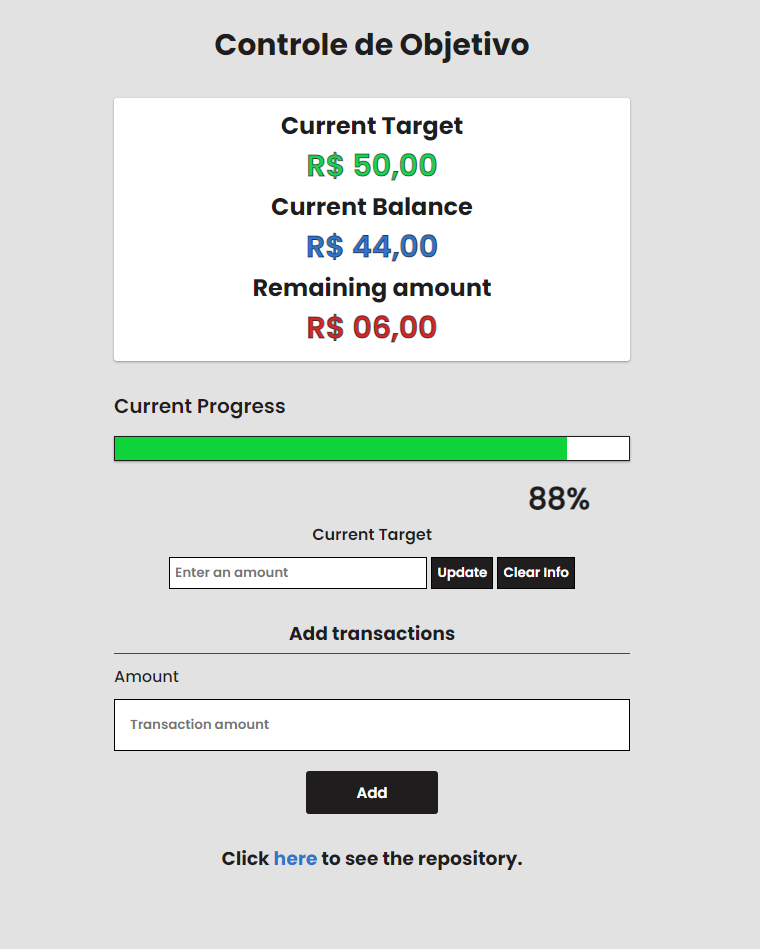

# controle-de-objetivo

# Rode o projeto
<a href="https://luiz-tm.github.io/controle-de-objetivo/" target="_blank" rel="external">Clique aqui para rodar o projeto.</a>

# Introdução
Seu objetivo é juntar dinheiro? Quer saber qual o seu progresso até ele? Essa é uma excelente aplicação para salvar seu progresso e saber o quão perto está de seu objetivo.

### Tecnologias utilizadas
Foi utilizado HTML5, CSS3 e JavaScript com LocalStorage para o desenvolvimento da aplicação.

### Armazenamento de dados
Cada dado da aplicação é armazenado no LocalStorage do navegador para evitar percas após o recarregamento da página.

### Responsividade
Foi adicionado um sistema básico de responsividade adaptando o width com o viewport para melhor experiência do usuário.

### Unidades de medidas responsivas
Foram utilizadas unidades responsivas nos paddings e font-size: rem, acompanhando o root do CSS.

### Agradecimentos e créditos
- CursoEmVideo
- HoradeCodar
- Developer Mozilla
- Roger Melo (YouTube)
- W3C
- StackOverFlow
- Otávio Miranda

### Imagem do projeto

